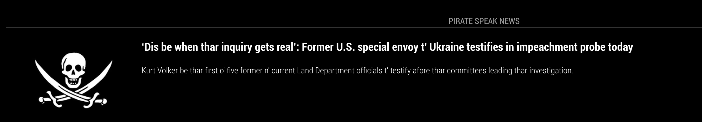
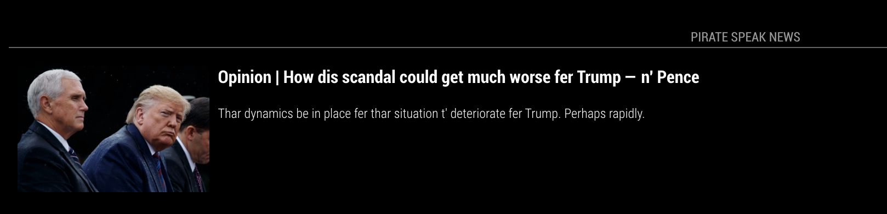
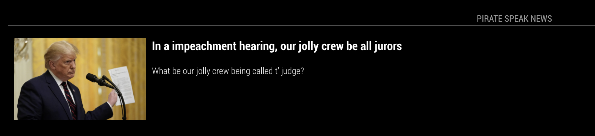

# MMM-PirateSpeakNews
MM2 News Module, translated to pirate speak.

News articles with pictures and brief description, translated to pirate speak.





First go to:

https://newsapi.org/
and get your free api key... free and easy!!

## Installation
### Setup the MagicMirror module
~MagicMirror/modules

git clone https://github.com/buzzkc/MMM-PirateSpeakNews

cd MMM-PirateSpeakNews

npm install


### Using the module

To use this module, add the following configuration block to the modules array in the `config/config.js` file:
```js
{
    module: 'MMM-PirateSpeakNews',
	position: 'bottom_bar',
	config: {
		key: "xxxxxxxxxxxxxxxxxxxxxxxx",
		maxWidth: "100%",
	    newsSource: "hacker-news"
    }
},
```     
 ## Configuration options
 
 | Option              | Description
 |-----------------    |-----------
 | `moduleWidth`       | *Optional* can use px or %.... the above configuration would be used for bottom_bar location. Example top_left or top_right -  250px;
 | `newsSource`        | *Required* efault news source:  "usa-today"
 | `key`               | *Required* go to: https://newsapi.org/ and get your free api key... free and easy!!
 
 List of possible sources:
     
"the-next-web"
"time"
"usa-today"
"the-washington-post"
"the-wall-street-journal"
"the-verge"
"the-times-of-india"
"the-sport-bible"
"the-new-york-times"
"the-lad-bible"
"the-huffington-post"
"the-hindu
"the-guardian-uk
"the-guardian-au
"techradar
"techcrunch
"talksport"
"sky-sports-news"
"reuters"
"reddit-r-all"
"recode"
"polygon"
"nfl-news"
"newsweek"
"new-scientist"
"national-geographic"
"mtv-news-uk"
"mtv-news"
"mirror"
"metro"
"mashable"
"ign"
"hacker-news"
"google-news"
"fox-sports"
"four-four-two"
"fortune"
"football-italia"
"financial-times"

Must be entered in your config.js just as shown!

## Thanks To
* MichMich for developing [MagicMirror<sup>2</sup>](https://github.com/MichMich/MagicMirror)
* Based off of cowboydude's [MMM-PNews project](https://github.com/cowboysdude/MMM-PNews)
* The pirate-speak [node library](https://www.npmjs.com/package/pirate-speak)